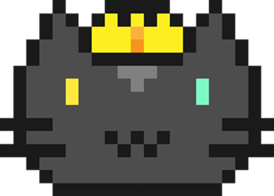
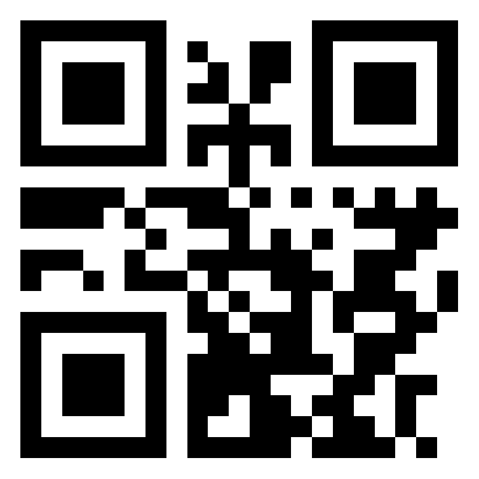
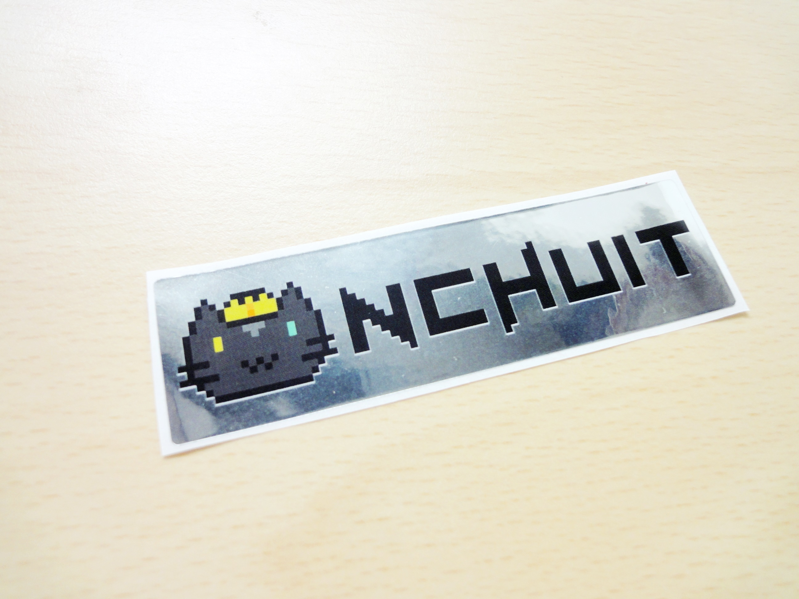

title: Begin
output: begin.html
controls: true
style: style.css

--

# 歡迎來到資訊社

-- <!-- socket -->

# 聊天室

--

### 流程

* **19:00 ~ 19:20** 開場白
* **19:20 ~ 19:35** 社課
* **19:35 ~ 19:45** ACM分享會
* **19:45 ~ 19:55** 開工計劃
* **19:55 ~ 20:05** Bonus:Maker工坊
* **20:05 ~ 20:15** 社團平台介紹
* **20:15 ~ 20:25** Q&A
* **20:25 ~ 21:00** 報名及自由時間

--

### 注意事項

* 我們全程有攝影機

--

### 注意事項

* ~~我們全程有攝影機~~

--

### 注意事項

* ~~我們全程有攝影機~~
* 我們全程備有

--

### 注意事項

* ~~我們全程有攝影機~~
* 我們全程備有
  * 零食 

--

### 注意事項

* ~~我們全程有攝影機~~
* 我們全程備有
  * 零食 
  * 飲料

--

### 注意事項

* ~~我們全程有攝影機~~
* 我們全程備有
  * 零食 
  * 飲料
  * 以及有獎徵答

--

# 獎品是什麼?

--

--

# 好 請問?

--

# 這是我們的吉祥物

--

# 他叫MoGi

--

# 有人知道為什麼嗎?

--

# ?????

--

--

# 最後 

--

# 我來講一個件事

--

### 根據

--

### 根據

* 英國研究

--

### 根據

* 英國研究
* 北韓宣稱

--

### 根據

* 英國研究
* 北韓宣稱
* 中國製造

--

### 根據

* 英國研究
* 北韓宣稱
* 中國製造
* 台灣媒體

--

# 研究指出

--

# 簡報中放一支貓 有助於提振大家的精神

--

--

#Thanks~

--
