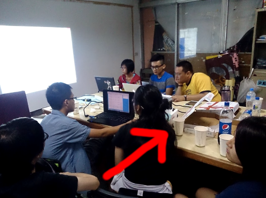

title: 104 學年度資訊社迎新 - 開工計畫介紹
author: 中興資訊社長 - PastLeo

%%%%%%%%%%%%%%%%%%%
% Use '%' to comment or directive (ex:css below)

%%%%%%%%%%%%%%%%%%%
%% You can add some custom style rules here...

%css

.slogen_with_pic h2 {
    margin-top: 10%;
}

.bigger_h2 h2 {
    margin-top: 15%;
    font-size: 3.5em;
}

%end

%%%%%%%%%%%%%%%%%%%
%% occupation of scale=1:
%% x = 1200
%% y = 700
%% occupation of scale=2: [occupation of scale=1] * 2
%% x = 2400
%% y = 1400
%% occupation of scale=3: [occupation of scale=1] * 3
%% x = 3600
%% y = 2100
%% occupation of scale=4: [occupation of scale=1] * 4
%% ...
%% the location of one step (slide) is originated from the center!

%%%%%%%%%%%%%%%%%%%
%% Here we go...

%%%%%%%%%%%%%%%
!SLIDE slogen_with_pic center x=-1000 y=-1600

## 對 Web, 程式解題都沒興趣嗎？

%%%%%%%%%%%%%%%
!SLIDE slogen_with_pic center x=200 y=-1600

## 你身懷絕技嗎？

%%%%%%%%%%%%%%%
!SLIDE slogen_with_pic center x=1400 y=-1600

## 你想要小試身手嗎？

%%%%%%%%%%%%%%%
!SLIDE bigger_h2 x=0 y=0 scale=4

## 開工計畫

#### Ideas 能在此互相激盪，也是 Coder 的小聚會

#### 週末`整天`窩在一起寫程式吧

%%%%%%%%%%%%%%%
!SLIDE slogen_with_pic center x=0 y=2000 rotate=180 scale=4

## 所以到底是？

%%%%%%%%%%%%%%%
!SLIDE center x=8400 y=2000 rotate=270 scale=10

### 首先，你可以帶著你/妳的

 * 對 xx 系統的不滿
 * 夢想，好啦或是構想
 * 或是程式作業

%%%%%%%%%%%%%%%
!SLIDE bigger_h2 x=3000 y=2000 z=-3000 rotate=300 scale=1

## 接著，這裏要講一個關於挖坑、推坑與填坑的故事

%%%%%%%%%%%%%%%
!SLIDE x=14400 y=2000 rotate=270 scale=6

## 來推坑、填坑吧！

#### 一起來利用資訊的力量改變這個世界！

%%%%%%%%%%%%%%%
!SLIDE x=6700 y=-2000 scale=6

## 那程式作業怎麼說？

%%%%%%%%%%%%%%% Ｑ＆Ａ
!SLIDE x=6300 y=-4000 rotate=20 scale=4

## 我們也歡迎來這裡做純粹的交流以及學習

#### 帶你的程式作業來給別人做 (X

#### 來這裡寫寫東西、同時互相交流學習 (O

%%%%%%%%%%%%%%%
!SLIDE bigger_h2 x=7000 y=-5000 rotate=40 scale=2

## Two more thing...

%%%%%%%%%%%%%%%
!SLIDE slogen_with_pic center x=7500 y=-6000 z=-100 rotate=60 rotate-x=90 rotate-y=90 rotate-z=90 scale=2

## 在這個活動中會有免費的吃吃喝喝

%%%%%%%%%%%%%%%
!SLIDE slogen_with_pic center x=7500 y=-6000 z=-10000 rotate=60 rotate-x=90 rotate-y=90 rotate-z=90 scale=2

## 而且我們上個學期還生出了 [選課小幫手](http://david30907d.github.io/CoursePickingHelper)!

%%%%%%%%%%%%%%%
!SLIDE x=10000 y=-15000 scale=2

## 以上，開工計畫，歡迎你的參與！

 * 時間：預設每週六下午一點到晚上，有更動時通知
 * 地點：學生會辦公室

%%%%%%%%%%%%%%%
!SLIDE bigger_h2 x=11000 y=-20000

## Bonus: Maker 工房

%%%%%%%%%%%%%%%
!SLIDE slogen_with_pic center x=12000 y=-20000

## 大家還活著嗎？

#### 我放張貓

%%%%%%%%%%%%%%%
!SLIDE bigger_h2 x=13000 y=-20000

## 社團平台介紹

%%%%%%%%%%%%%%%
!SLIDE x=13000 y=-21000

## Facebook 社團

#### 中興-資訊交流網

%%%%%%%%%%%%%%%
!SLIDE slogen_with_pic center x=13000 y=-22000

## Facebook 粉專

#### 中興大學-資訊科學研習社

#### 快來按讚◝(●˙꒳˙●)◜

%%%%%%%%%%%%%%%
!SLIDE x=13000 y=-23000

## Slack

%%%%%%%%%%%%%%%
!SLIDE x=14000 y=-20000

## Any Questions?

#### 沒有的話就來報名吧
